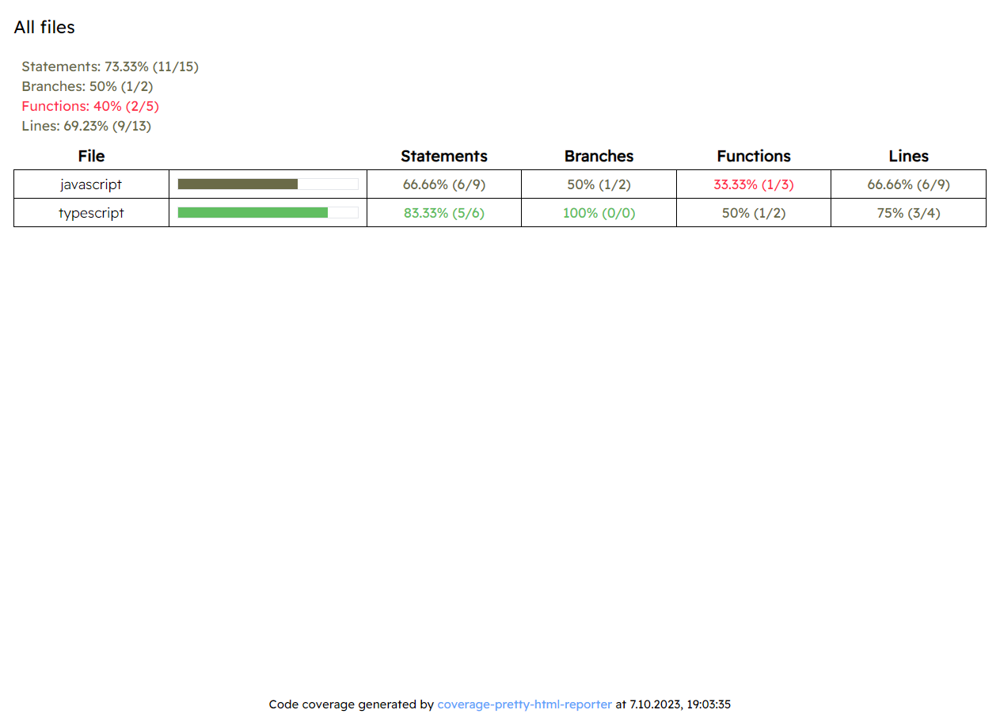
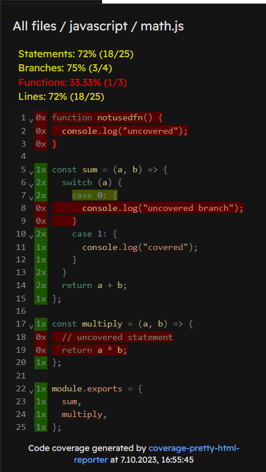

# coverage-pretty-html-reporter

> [!WARNING]
> This package is still in the experimental phase. You can expect new functionalities, but with this comes the possibility of more frequent errors

Directory summary (light theme) |  File coverage (dark theme)
:------------------------------:|:----------------------------:
  | 

## Installation

You can use your favorite package manager

```sh
npm i -D coverage-pretty-html-reporter
yarn add -D coverage-pretty-html-reporter
pnpm add -D coverage-pretty-html-reporter
bun add -D coverage-pretty-html-reporter
```

Then configure `nyc` / `c8` to use *coverage-pretty-html-reporter*
```sh
nyc --reporter=coverage-pretty-html-reporter mocha # ...
c8 --reporter=coverage-pretty-html-reporter mocha # ...
```

If you are using `jest` / `vitest` or other framework you may place correct config ex.:
```js
/** @type {import('jest').Config} */
const config = {
  coverageReporters: ['coverage-pretty-html-reporter'],
};
```
```js
import { defineConfig } from "vitest/config";
export default defineConfig({
  plugins: [],
  test: {
    coverage: {
      enabled: true,
      // @ts-expect-error
      reporter: ["coverage-pretty-html-reporter"],
    },
  },
});
```

## Reading coverage report

`coverage-pretty-html-reporter` does not support viewing web-page locally (via file:// protocol) (i.e. double clicking the .html file). You need to publish coverage directory on local network ex.:

```sh
# When using npm
npx http-server ./coverage
# When using pnpm
pnpm dlx http-server ./coverage
# When using bun
bunx http-server ./coverage
```

## Contributing

Fell free to report any bugs & share your ideas. PRs are welcome.

## Developer guide

Requirements (see package.json#packageManager):
- bun@1.0.4
- node@^18.17.1

```sh
git clone git@github.com:akcyp/coverage-pretty-html-reporter.git
cd coverage-pretty-html-reporter

# Init
bun i
bun run build

# Production testing
bun run demo:nyc # or demo:c8
bun run demo:preview

# UI development
cd packages/reporter
bun run dev

# Reporter development - only production testing
# edit packages/reporter/node/index.ts
cd packages/example
bun run test:c8
bun run test:nyc
```
