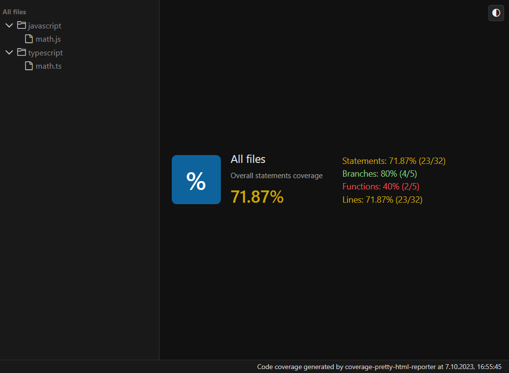
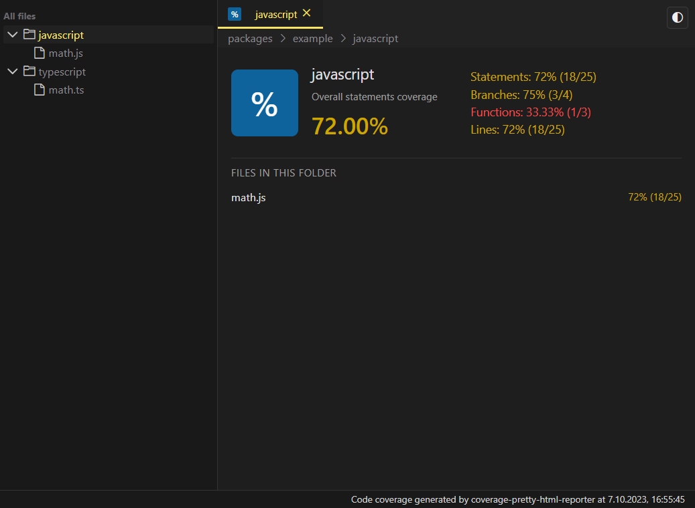
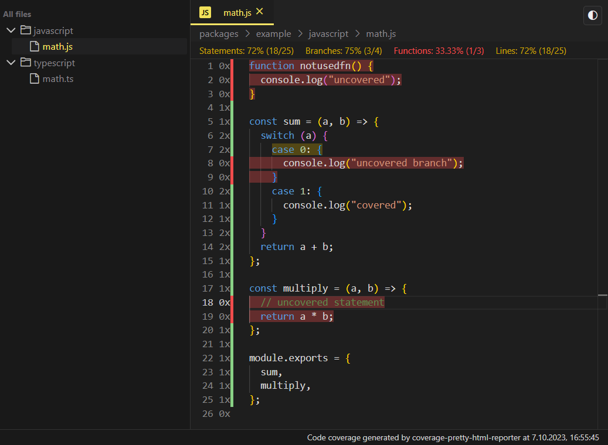
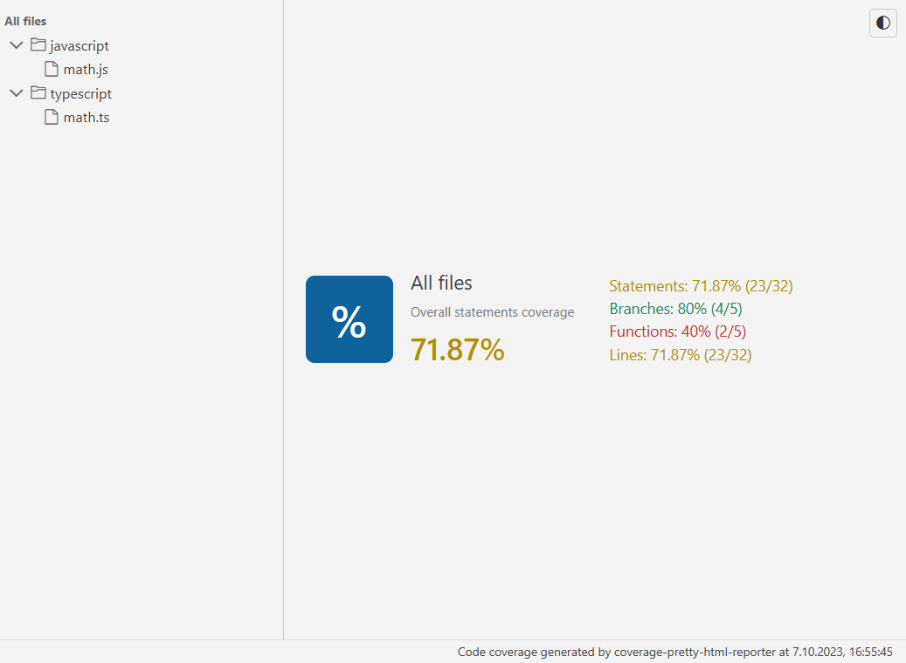
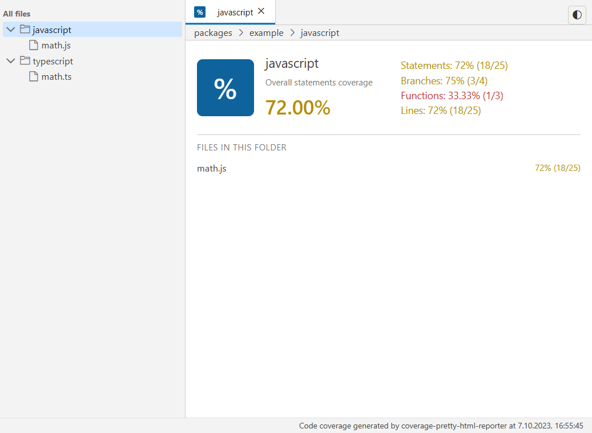
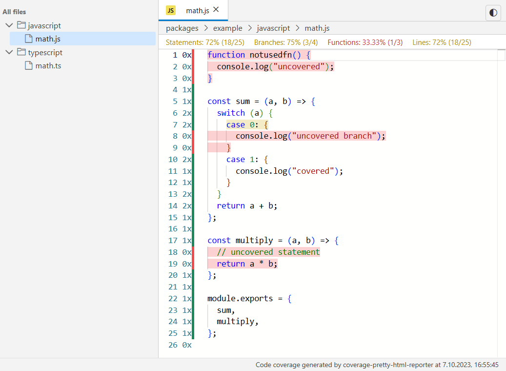

# coverage-pretty-html-reporter

> [!WARNING]
> This package is still in the experimental phase. You can expect new functionalities, but with this comes the possibility of more frequent errors

Home | Stats | Code
:----:|:---:|:---:
 |   | 
 |   | 

## Installation

You can use your favorite package manager

```sh
npm i -D coverage-pretty-html-reporter
yarn add -D coverage-pretty-html-reporter
pnpm add -D coverage-pretty-html-reporter
bun add -D coverage-pretty-html-reporter
```

Then configure `nyc` / `c8` to use *coverage-pretty-html-reporter*
```sh
nyc --reporter=coverage-pretty-html-reporter mocha # ...
c8 --reporter=coverage-pretty-html-reporter mocha # ...
```

If you are using `jest` / `vitest` or other framework you may place correct config ex.:
```js
/** @type {import('jest').Config} */
const config = {
  coverageReporters: ['coverage-pretty-html-reporter'],
};
```
```js
import { defineConfig } from "vitest/config";
export default defineConfig({
  plugins: [],
  test: {
    coverage: {
      enabled: true,
      // @ts-expect-error
      reporter: ["coverage-pretty-html-reporter"],
    },
  },
});
```

## Iframe - theme support

When the reporter UI is embedded in an iframe, the built-in theme toggle button is hidden. In this mode you are expected to control the theme from the parent window.

The iframe listens for postMessage events with the following payload:

```ts
type CoverageThemeMessage = {
  type: "coverage-theme";
  theme: "light" | "dark";
};
```

Example integration in the parent page:

```html
<iframe
  id="coverage-report"
  src="/path/to/coverage/index.html"
  style="width: 100%; height: 100%; border: 0;"
></iframe>

<script>
  const iframe = document.getElementById("coverage-report");

  function setCoverageTheme(theme) {
    iframe?.contentWindow?.postMessage({ type: "coverage-theme", theme }, "*");
  }

  // Send initial theme once the iframe is loaded
  iframe.addEventListener("load", () => {
    const prefersDark = window.matchMedia("(prefers-color-scheme: dark)").matches;
    setCoverageTheme(prefersDark ? "dark" : "light");
  });

  // Example: hook into your own app theme system
  window.addEventListener("app-theme-changed", (event) => {
    setCoverageTheme(event.detail.theme); // "light" | "dark"
  });
<\/script>
```

Inside the iframe, the selected theme is persisted in localStorage under the coverage-theme key and a coverage-theme-changed CustomEvent is dispatched on window so internal components can react to theme changes.

```

## Contributing

Fell free to report any bugs & share your ideas. PRs are welcome.

## Developer guide

Requirements (see package.json#packageManager):
- bun@1.0.4
- node@^18.17.1

```sh
git clone git@github.com:akcyp/coverage-pretty-html-reporter.git
cd coverage-pretty-html-reporter

# Init
bun i
bun run build

# Production testing
bun run demo:nyc # or demo:c8
bun run demo:preview

# UI development
cd packages/reporter
bun run dev

# Reporter development - only production testing
# edit packages/reporter/node/index.ts
cd packages/example
bun run test:c8
bun run test:nyc
```
